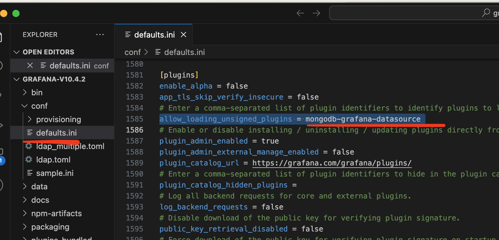
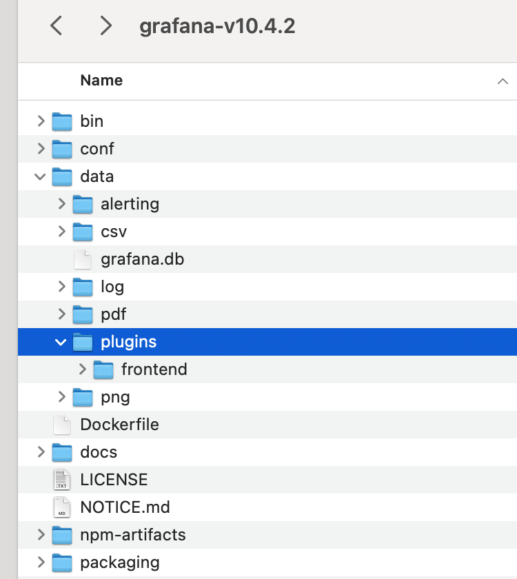
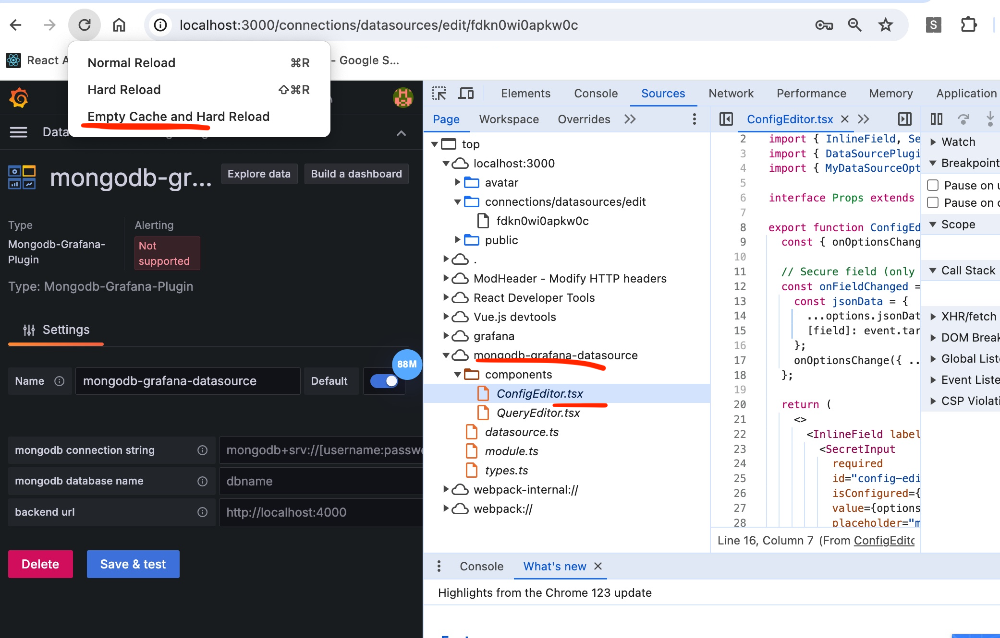
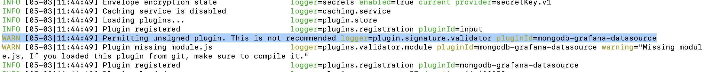
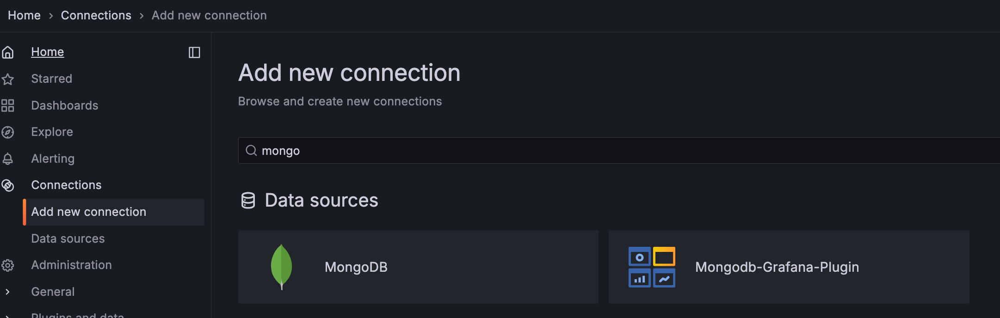
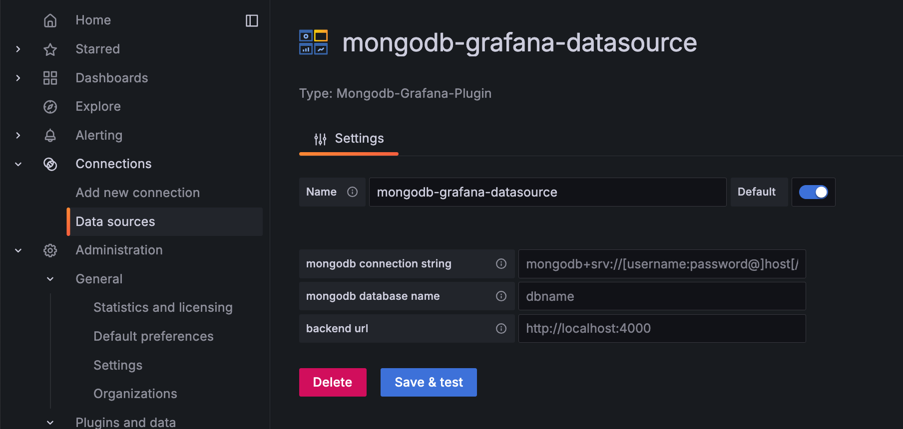
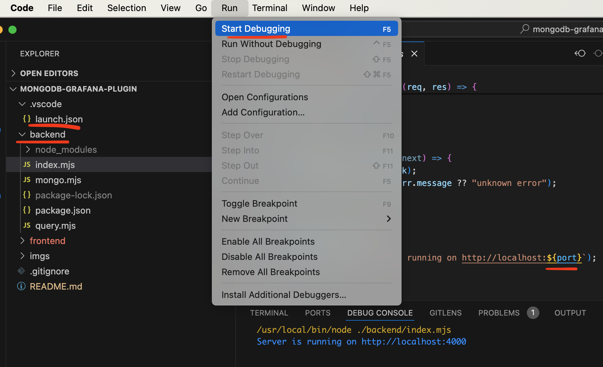
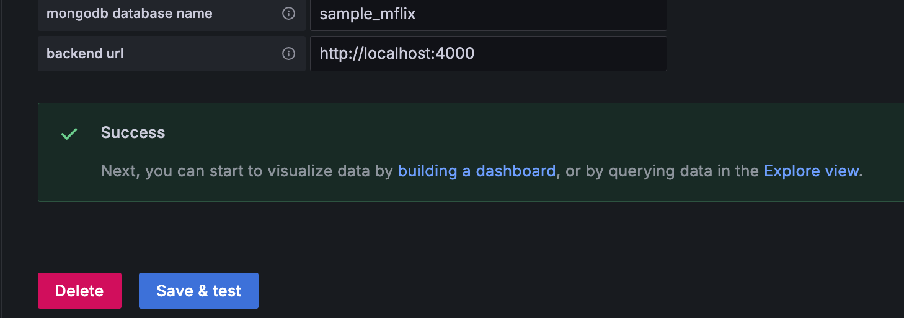

# mongodb-grafana-plugin

this repo tries to modernize the good work from the [mongodb-grafana](https://github.com/JamesOsgood/mongodb-grafana) repo.

## installation
0. clone the repo

1. download and install grafana locally from [here](https://grafana.com/grafana/download)

2. enable unsigned plugins (yes, the plugin is unsigned)



3. copy the `frontend` folder to the installed grafana



build the frontend
```bash
cd [grafana installed path]/data/plugins/frontend
npm install
npm run dev
```

**<ins>after step 4 and 5 below</ins>**, since it is a debug build, you code change in the frontend will take effect immediately. open a chrome's inspector, just do an `Empty Cache and Hard Reload` to load the new change(s).



4. launch grafana
```bash
cd [grafana installed path]
./bin/grafana server
```


5. add and configure the datasource

choose `Mongodb-Grafana-Plugin`


configure the mongodb connection parameters and the plugin's backend url


6. run the `backend`

```bash
cd [repo path]/backend
npm install
```

open the repo from visual studio code. the backend is in the `backend` folder. it is default hardcoded to use port number 4000 and a `launch.json` has been provided. just `Run | Start Debugging` from menu bar



7. save the database connection

go back to setp 5, click on the `Save & test` button. 



hurray! you have everything set up.

## query