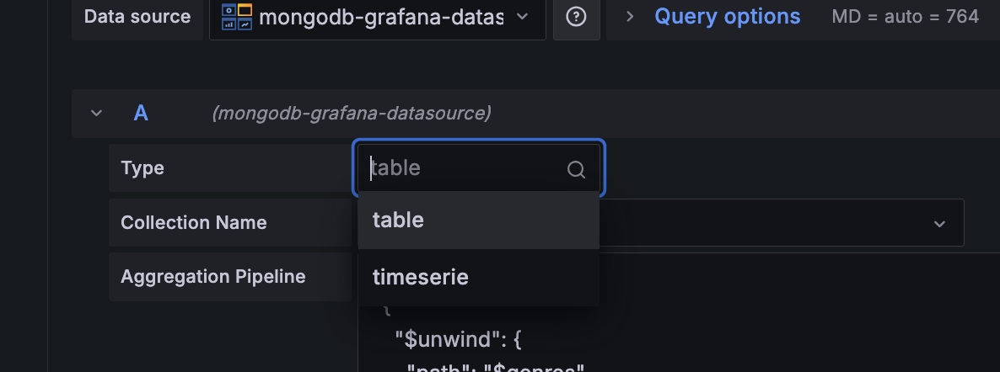
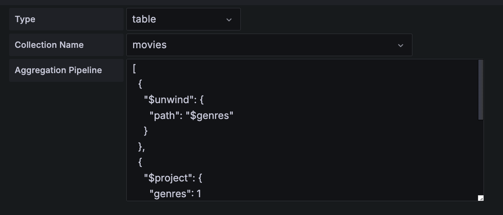
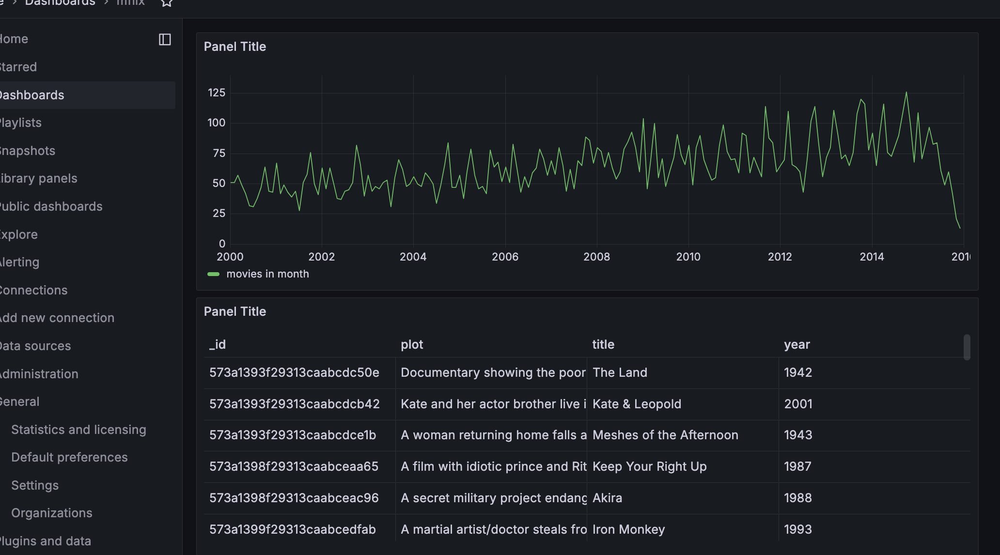

# mongodb-grafana-plugin

this repo tries to modernize the good work from the [mongodb-grafana](https://github.com/JamesOsgood/mongodb-grafana) repo.

the mongodb plugin is a full stack app. it has to, because a webapp can't use a mongodb driver binary. it has,

- a frontend
    - used by the grafana UI
    - help configure the database connection and collect user queries
- a backend
    - run outside of grafana as a standalone node.js app
    - receive the queries from the frontend
    - call mongodb driver to execute the queries
    - return as either tabular or timeseries data frames 
## installation
see installation steps [here](./INSTALL.md)

## query

### query types

there are two types of query the plugin supports, `table` or `timeserie`.



### query schema
```javascript
  {
    collection: "collection name",
    aggregations: [
      {
        string: "string",
        date: new Date(),
        id: new ObjectId("573a1393f29313caabcdc50e"),
        bool: true,
        float: 12345.4,
        expandable1: $from,
        expandable2: $to,
        expandable3: $intervalMs
      },
    ],
  }
```



the `collection` field specifies the name of the collection to perform an aggregation.

the `aggregations` field can have multiple aggregations. the supported data types and examples are listed above.

`timeserie` in detail

- `$from`, `$to`, `$intervalMs` are grafana expandable variables for using as a time boundary and an interval
- `__name`, `__value`, `__timestamp` are the plugin's internal variables to construct a grafana timeserie data frame
- an example query can be found at [code](./sample/timeserie-query.json). all 6 parameters mentioned above are used. it `$group` by month and `$sum` how many movies were released during a month.

## sample dashboard

an example dashboard can be found at [here](./sample/dashboard.json)


